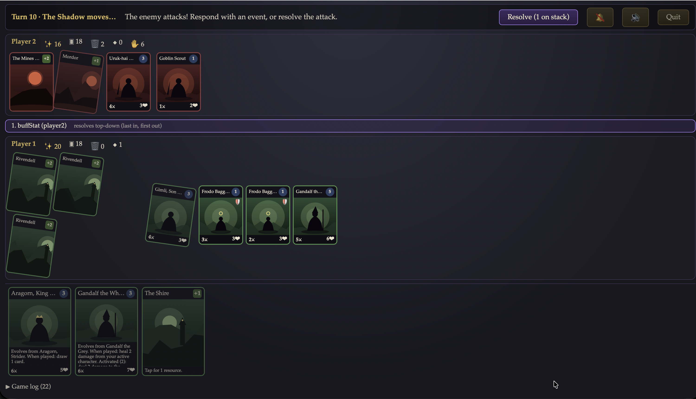

# Tales of Middle-earth — Documentation

A browser trading card game set in Middle-earth, inspired by the Pokémon TCG
and Magic: The Gathering. Play against the computer at three difficulties, or
two players on one screen. Built almost one-shot by Claude Fable 5 —
[source on GitHub](https://github.com/jbrwilkinson/Trading-Card-Game-Fable5).



## Playing

- **[Game rules](./rules.md)** — how to play: setup, turn phases, combat and
  the stack, evolution, corruption, retreat, abilities, deck construction,
  and every tuned constant in one table.

## Extending

- **[Card authoring guide](./card-authoring-guide.md)** — add your own cards
  with plain JSON, no programming: file layout, every field, the complete
  effect vocabulary, ability triggers, costing guidance, and the
  `npm run validate-cards` workflow.
- **[Architecture](./architecture.md)** — how it's built: the pure-reducer
  rules engine, the single-source-of-truth `legalActions`, the heuristic AI,
  generative art and synthesized audio, and the testing strategy.

## How this project was made

- **[The prompt](./prompt.txt)** — the original request given to Claude.
- **[The plan](./plan.md)** — the implementation plan Claude produced and
  then executed milestone by milestone.

## Running it

```bash
npm install
npm run dev        # → http://localhost:5173
npm test           # all test suites
npm run test:coverage
npm run validate-cards
```
